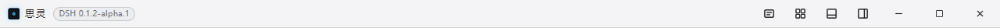
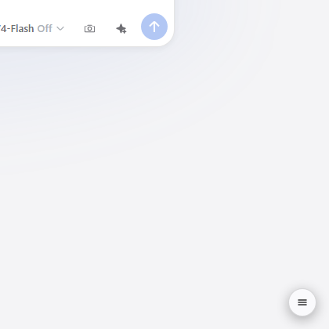
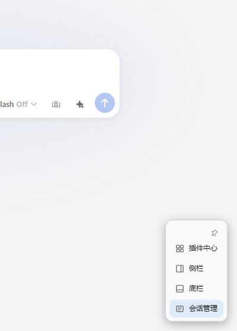

# @max-null/dsh-quick-toolbar

本插件属于 **`@max-null/*` 插件系列**——这一系列共同构成 **[SSID（思灵 · Seek Soul in Darkness）](https://github.com/Max-Null/seek-soul-in-darkness)** 桌面体验。SSID 是整合它们的盒：`dsh-capture` · `dsh-chat-rail` · `dsh-chinese-thinking` · `dsh-draft-polish` · `dsh-guardian` · `dsh-habit` · `dsh-memory` · `dsh-node-appearance` · `dsh-plugin-center` · `dsh-quick-toolbar` · `dsh-skill-mcp-center` · `dsh-ssid-panels` · `dsh-ssid-zh-ui`。

This plugin belongs to the **`@max-null/*` family** — a set of plugins that together form the **[SSID (思灵 · Seek Soul in Darkness)](https://github.com/Max-Null/seek-soul-in-darkness)** desktop experience.

面向 [DeepSeek Harness](https://github.com/deepseek-ai/deepseek-harness) 的**插件按钮聚合器**：把三方插件散乱的按钮（插件中心/侧栏/底栏/会话管理…）聚合到统一入口——SSiD 壳 → 标题栏按钮组；DSH web → **iOS 小白点式悬浮球**（自由定位拖拽、球↔面板 morph 展开、球永远锁定面板屏幕外侧角）。适配器驱动：内置适配集开箱即识；**用户环境下 LLM 按模板生成适配**（驻场工程师模式）——不要求三方插件配合。

A **plugin-button aggregator** for [DeepSeek Harness](https://github.com/deepseek-ai/deepseek-harness): gathers scattered third-party plugin buttons (plugin center / sidebar / bottom bar / session manager …) into one entry — an SSiD title-bar button group in the SSID shell, and an iOS assistive-touch-style floating ball on plain DSH web (free positioning & dragging, ball↔panel morph expand, ball always locked to the panel's screen-outer corner). Adapter-driven: bundled adapters work out of the box; in any user environment, an LLM generates new adapters from a template (the "on-site engineer" mode) — no cooperation required from third-party plugins.

## 截图

| SSiD 标题栏（壳） | web 悬浮球 | 聚合面板 |
|---|---|---|
|  |  |  |

> 截图环境：SSiD 0.1.15 壳（标题栏）与 DSH master web（悬浮球/面板）；聚合面板为 web 右下角悬浮球 morph 展开态。

## 安装

```sh
# 走 DSH 插件安装（或 SSiD 预制 vendor）
dsh plugin --profile web add @max-null/dsh-quick-toolbar
```

## 使用

- **聚合按钮**：标题栏/悬浮球点开面板 → 一键触发各插件功能（再点关闭——会话管理探测弹窗关闭按钮）。
- **用户适配器**：复制 `adapters.prompt.md` + 环境描述 → 让 LLM 生成 `{ "adapters": [...] }` → 写入 `~/.dsh/quick-toolbar-adapters.json` → 重启/热载生效（schema 校验，非法条目丢弃并报明细）。
- 定位失败/插件未装/被禁用 → 静默跳过（绝不误伤、绝不误点）。

## 架构

- `src/adapters.ts`：适配器 schema + 内置适配器集（黄金示例）
- `src/behaviors.ts`：行为库（click / toggle-panel / dispatch-event / open-settings / command）
- `src/engine.ts`：执行器（防御执行）
- `src/schema.ts`：用户配置 zod 校验（LLM 产物防线）
- `src/index.ts`：host 半 `GET /quick-toolbar/api/adapters`
- 设计文档：`doc/设计/2026-08-30-quick-toolbar-独立化设计方案.md`、`doc/设计/2026-08-30-quick-toolbar-v2设计.md`

## 开发

```sh
pnpm install
pnpm typecheck && pnpm test && pnpm build   # L1 门槛（20+ 用例）
```

## SSID 系列

SSiD 全家桶（[max-null-plugins](https://github.com/Max-Null)）的一员；SSiD 壳内与标题栏桥接协作（`__SSID_SHELL__` 分支）。
