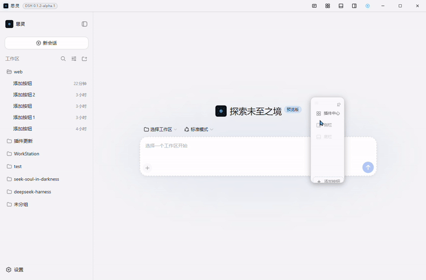
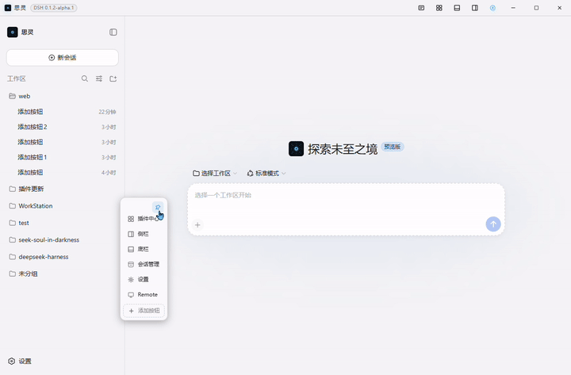
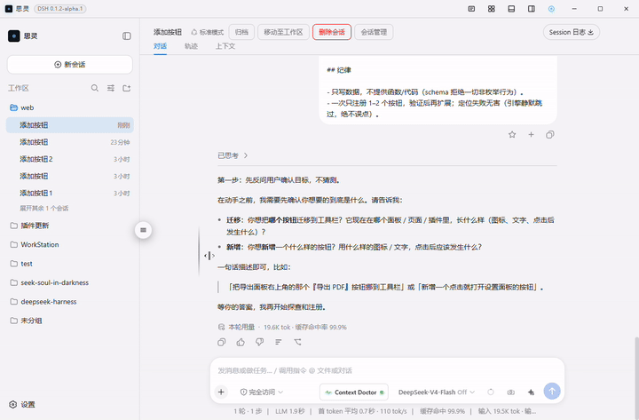
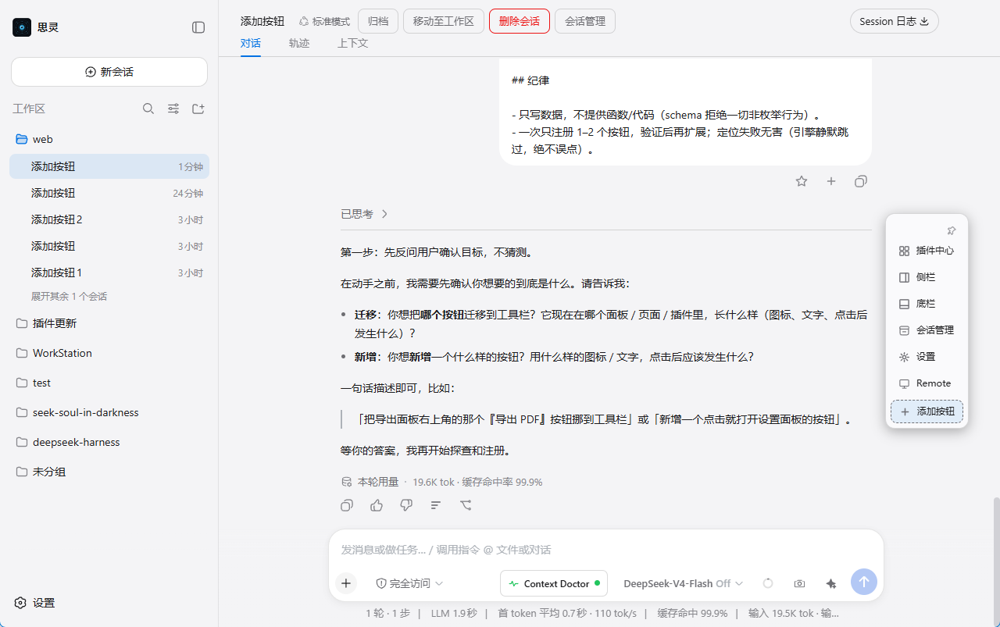

# @max-null/dsh-quick-toolbar

本插件属于 **`@max-null/*` 插件系列**——这一系列共同构成 **[SSID（思灵 · Seek Soul in Darkness）](https://github.com/Max-Null/seek-soul-in-darkness)** 桌面体验。SSID 是整合它们的盒：`dsh-capture` · `dsh-chat-rail` · `dsh-chinese-thinking` · `dsh-draft-polish` · `dsh-guardian` · `dsh-habit` · `dsh-memory` · `dsh-node-appearance` · `dsh-plugin-center` · `dsh-quick-toolbar` · `dsh-skill-mcp-center` · `dsh-ssid-panels` · `dsh-ssid-zh-ui`。

This plugin belongs to the **`@max-null/*` family** — a set of plugins that together form the **[SSID (思灵 · Seek Soul in Darkness)](https://github.com/Max-Null/seek-soul-in-darkness)** desktop experience.

面向 [DeepSeek Harness](https://github.com/deepseek-ai/deepseek-harness) 的**插件按钮聚合器**：把三方插件散乱的按钮（插件中心/侧栏/底栏/会话管理…）聚合到统一入口——SSiD 壳 → 标题栏按钮组；DSH web → **iOS 小白点式悬浮球**（自由定位拖拽、球↔面板 morph 展开、球永远锁定面板屏幕外侧角）。**核心价值 = 可扩展性**：本插件是「载体」（协议 + 引擎 + 注册表），**每个人都可以把**自己环境里任何插件的按钮**聚合进来**（LLM 一键注册 / 右键删除 = 注册制/注销制，全程不动插件源码、不写一行代码）——不要求第三方插件配合，不需要等作者适配。

A **plugin-button aggregator** for [DeepSeek Harness](https://github.com/deepseek-ai/deepseek-harness): gathers scattered third-party plugin buttons (plugin center / sidebar / bottom bar / session manager …) into one entry — an SSiD title-bar button group in the SSID shell, and an iOS assistive-touch-style floating ball on plain DSH web (free positioning & dragging, ball↔panel morph expand, ball always locked to the panel's screen-outer corner). **Extensibility is the point**: this plugin is a *carrier* (protocol + engine + registry) — **everyone can register the buttons of any plugin in their own environment** (LLM one-click registration / right-click deregistration; no plugin source touched, no code written, no cooperation required from third-party plugins).

## 理念：载体 + 驻场 LLM——动态聚合，零代码增删

```
你的环境 = 插件 A · 插件 B · 插件 C（各自散落的按钮）
        └── 聚合到本工具栏（一个入口）
                     ▲
   注册（➕ 一键，LLM 探查+数据注册）/ 注销（右键删除=移除注册）
```

- **插件 = 载体**：本插件只提供注册协议（字段/校验/引擎行为）与渲染执行器；不内置任何场景适配——场景无限，没有"完美脚本"能预适配所有环境。
- **适配 = 驻场 LLM 域**：点击 ➕ 发起「添加按钮」会话，环境里的 LLM 自主探查（浏览器/代码能力验证选择器）→ 生成纯数据注册（一条 JSON）。**添加 = 注册制**（不动插件原代码）。
- **删除 = 注销制**：右键按钮 → 滑出「删除」→ 移除注册、原按钮恢复显示，环境回到未注册原状（零代码残留、零回滚成本）。
- **人人可用**：你不需要会写插件——告诉 LLM"把某个按钮加进来"，它替你完成全部探查与注册；任何插件的按钮都能聚合，无论是官方的、社区的还是你自己的。

## 截图

### 动态聚合（GIF 实录）

| 聚合面板（内置 + LLM 注册按钮 + ➕） | 右键滑动删除（注销制） |
|---|---|
|  |  |

| 二次点击关闭（引擎探测语义） | ➕ LLM 注册会话（反问 → 探查 → 注册） |
|---|---|
|  |  |

### 一图两景：聚合面板 × LLM 反问（真实环境）



> Remote 为用户 LLM 现场注册的按钮（ds-harness-remote 入口）——演示「任何插件按钮都能聚合进统一入口」；右侧面板同时展示 LLM 按任务书先反问目标、再探查注册的完整流程。

| SSiD 标题栏（壳） | web 悬浮球 |
|---|---|
|  |  |

> 截图环境：SSiD 壳（标题栏/聚合面板）与 DSH web（悬浮球）；Remote 为用户 LLM 现场注册的按钮（ds-harness-remote 入口），演示「统一入口聚合散落按钮」。

## 安装

```sh
# 走 DSH 插件安装（或 SSiD 预制 vendor）
dsh plugin --profile web add @max-null/dsh-quick-toolbar
```

## 使用

- **聚合按钮**：标题栏/悬浮球点开面板 → 一键触发各插件功能（再点关闭——会话管理探测弹窗关闭按钮；设置面板语义锚点打开/再点关闭）。
- **内置入口**：悬浮球含「设置」（官方设置面板：引擎按语义锚点定位 footer 触发器，双 locale；再点关闭——DSH trigger 原生只开不关）。
- **壳环境（SSiD）**：悬浮球默认隐藏（标题栏接管入口）；标题栏「悬浮球」开关按钮（圆圈+圆点图标）可开启。
- **用户适配器**：点面板 ➕ 或复制 `adapters.prompt.md` 到任意会话 → LLM 生成 `{ "adapters": [...] }` → 写入 `~/.dsh/quick-toolbar-adapters.json` → 刷新页面生效（host API 校验，非法条目丢弃并报明细）。**推荐直接走 ➕（见教程）**。
- 定位失败/插件未装/被禁用 → 静默跳过（绝不误伤、绝不误点）。
- **状态持久化**：位置/钉住/折叠/壳开关走 host（`/quick-toolbar/api/state` → `~/.dsh/quick-toolbar-state.json`，SSiD 开发手册 §7.10 规则）——内核动态端口不再丢状态。
- **收藏会话**（v0.9.0）：面板顶部的 ☆ 一键收藏/取消收藏**当前会话**；已收藏的会话平铺在功能按钮之上，**点一下即切过去**（`sessions.open`）。作用域 = **与当前会话同属一个工作区**的收藏——判据是工作区的成员表（`WorkspaceView.sessionIds`，与 DSH 左侧栏的分组同一来源），不是会话的 `cwd`；未归入任何工作区的会话自成一组。**每个工作区上限 8 个**——满时 ☆ 置灰并在悬停提示说明。会话被删除后其入口自动消失；当前会话本身不占入口。持久化同样是 host 文件（`~/.dsh/quick-toolbar-favorites.json`），换机器/重启内核都还在。

## 教程：迁移 / 新增一个按钮（开一个会话，让 LLM 来做）

> **核心观念：迁移按钮不是自己写配置，而是开一个会话，把任务交给环境里的 LLM。**
> 本插件是「载体」，不内置扫描器、不预设所有场景——**适配由你环境里的 LLM 现场完成**
> （驻场工程师模式）；你只需要告诉它要哪个按钮。此设计不是社区主流，但它承诺：
> 环境里任何按钮都能被聚合，无需第三方插件配合、无需等待本插件适配。

**推荐路径（三步，约 1 分钟）：**

1. **点击工具栏面板里的 ➕「添加按钮」**——插件创建「添加按钮」会话并把注册任务书注入其中（自动执行，无需你打字；服务不可用时退化为输入框草稿，按 Enter 发送）。若环境支持复制，也可直接复制 `adapters.prompt.md` 到任意会话。
2. **回答 LLM 的反问**——它会先问清楚目标：*迁移*（哪个按钮？在哪个面板/插件里？）
   还是*新增*（图标/文字/点击后发生什么？）。回答后 LLM 才会动手——它不会猜。
3. **LLM 自主探查并注册**——它用自己的浏览器/代码能力找到目标、验证选择器，
   把最小注册 `{ "adapters": [{ "id": "...", "button": "..." }] }` 写入
   `~/.dsh/quick-toolbar-adapters.json`。你**刷新页面**，按钮即出现在工具栏。
   若未出现，告诉 LLM，它会修正重试。

**手动方式（高级用户）**：跳过会话，直接编辑 `~/.dsh/quick-toolbar-adapters.json`
（同 id 覆盖既有注册；非法条目被 host 校验丢弃并报明细——详见 `adapters.prompt.md` 字段表）。

**说明**：注册结果是**纯数据**（图标/文字/点击由载体派生或按声明执行），不是代码——
LLM 注册完就无需在场；那份 JSON 可导出、可备份、可随环境迁移。

**删除按钮**：在工具栏面板里**右键点击该按钮 → 「删除此按钮」**（仅用户注册的按钮；
内置按钮不可删）。删除后原按钮恢复显示、配置写回 `~/.dsh/quick-toolbar-adapters.json`
（也可直接手动编辑该 JSON）。**SSiD 壳环境路径**：标题栏「悬浮球」开关（圆圈+圆点）→
球显示 → 点球展开面板 → 右键按钮 → 滑出「删除」。

> **English quick start** — *Moving a button in is NOT a settings task: open a session and let the on-site LLM do it.* Click the **➕ "Add button"** in the toolbar panel; the plugin creates an "Add button" session and injects the registration brief into it (auto-runs; falls back to a composer draft if the session service is unavailable). The LLM will first ask you which button to migrate / what new button you want, then it explores the environment, verifies the selector, writes `{ "adapters": [...] }` to `~/.dsh/quick-toolbar-adapters.json`, and you refresh the page. Registration results are plain data — the carrier derives icon/text/click from the original button, and the LLM is no longer needed afterwards.

## 架构

- `src/adapters.ts`：适配器 schema + 内置适配器集（黄金示例）
- `src/behaviors.ts`：行为库（click / toggle-panel / dispatch-event / open-settings（语义锚点+再点关闭）/ command（composer 注入）——全部实现，v2 M1）
- `src/engine.ts`：执行器（防御执行）
- `src/schema.ts`：用户配置 zod 校验（LLM 产物防线）
- `src/register-brief.ts`：➕ 按钮注入的注册任务书（先反问 → 探查 → 最小注册，与协议字段同步，锚点测试防漂移）
- `src/index.ts`（host 半）：`GET /quick-toolbar/api/adapters`（用户适配器）+ `GET/POST /quick-toolbar/api/state`（状态 host 化，原子写）
- 设计文档：`doc/设计/2026-08-30-quick-toolbar-独立化设计方案.md`、`doc/设计/2026-08-30-quick-toolbar-v2设计.md`

## 开发

```sh
pnpm install
pnpm typecheck && pnpm test && pnpm build   # L1 门槛（20+ 用例）
```

### 构建：两个入口必须分别构建（共享模块会被拆 chunk，DSH 加载器不认）

`tsdown.config.ts` 用的是**数组配置**（两次独立构建），而不是一个 `entry: ['src/index.ts', 'src/client.ts']`。原因：client 半与 host 半共享的模块（如 `src/favorites.ts`）在多入口单次构建下会被提成 `favorites-<hash>.js` 共享 chunk，`lib/client.js` 顶部随之多出一条 `import ... from './favorites-<hash>.js'`；而 DSH 的 client 模块加载器按**单文件**取 `/plugins/<pkg>/client.js`（合并 bundle 的 `??pkg/client.js,...` 协议不会去拉那个相对 chunk），于是**整个 client 半静默失效**——2026-09-14 实测现象是工具栏连同所有功能按钮一起消失、页面无报错，而 host 路由仍正常响应（很容易误判成服务端问题）。

同步 vendor 时同理：产物不保证就是固定两个文件，要**整目录镜像**并清掉不再产出的旧 hash 文件，别只复制 `client.js`/`index.js`。

另外 host 半用 `platform: 'node'`（对其本来语义正确），该组合下 ESM 默认输出 `.mjs`，已用 `outExtensions` 钉死 `.js` 以匹配 `package.json` 的 `main`/`exports`。

### 已知限制：改本插件不触发热更新，需重启内核（待办）

SSiD 的 profile 以 `file:./vendor/dsh-quick-toolbar` 声明本插件，其 client 半因此不在 DSH 的 client modules 表里：`artifactBaseline(id)` 返回 undefined，而 HMR 的监听集正是「graph 中能提供 baseline 的行」（`packages/client/hmr/src/index.ts:128-141`，`artifactBaseline` 见 `packages/client/modules/src/index.ts:624`）。

实测（2026-09-14）：改 `node_modules` 或 `vendor` 任意一份 `lib/client.js` 的内容，30 秒内无任何重载反应；同一时刻改 npm 包形式的 `dsh-chat-rail`（`0.6.1`）3 秒即重载。**后果**：改本插件的样式或逻辑后需重启内核才生效（发版/归档流程不受影响——那本就是重新部署）。

**待办**：查清这是 DSH 的既定行为，还是我们的声明方式可调。

- 若为既定行为 → 在 SSiD 开发手册 §7 记一条「vendor 集成的插件不吃 HMR」，并接受「改本插件要重启」；
- 若 `file:` 依赖可换写法（例如改回 npm 包声明、vendor 只作归档源）→ 本插件即可恢复热更新。

**已做的兼容**（commit `47c86ca`）：`apply` 的样式注入已改为幂等 + 内容比对，并提到防重守卫之前——一旦它被重载（插件中心禁用/启用、内核重启，或将来 HMR 覆盖到它），不会重复注入，`SHELL_CSS` 也能在壳标志晚到时补进去。

## SSID 系列

SSiD 全家桶（[max-null-plugins](https://github.com/Max-Null)）的一员；SSiD 壳内与标题栏桥接协作（`__SSID_SHELL__` 分支）。
